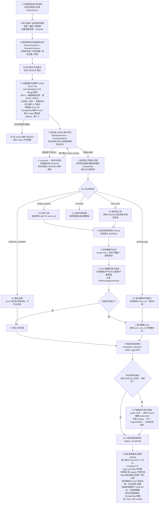

# ScrapeFlow 产品与工程合同

## 0. 权威声明

本文件是 ScrapeFlow 唯一的长期产品与工程合同。层级如下:

- 本文件 = 目标行为 + 工程边界 + 领域模型 + Agent 纪律,冲突时的最高权威。
- `README.md` = 操作入口(部署、配置、API、检查命令)。
- `docs/` 如存在仅作历史参考，不覆盖本文件，也不构成部署或运行前提。
- 代码与测试是实现证据;与本文件冲突时以本文件为准,并明确报告冲突。
- 用户最新明确指令与本文件冲突时,报告冲突,不得擅自发明新架构。

### 现行实现边界（2026-08-18，单机简化裁决）

目标领域模型（`IntakeSource → RootJob → WorkUnit`）已接入入站与执行链路。`EngineJob` 只保留为内部单作品执行和写后回读载体；新增能力必须走目标领域模型，不能继续向 `EngineJob.summary` 堆业务语义。

- 运行时只有一个 API、一个本地 writer 和一个本地 JSON 控制记录 `{paused, root_job_id}`；不实现 revision、CAS、scope、第二 API 竞争协议或控制平面。
- 任务从 `/待刮削` 的只读发现开始，用户创建并选择唯一 RootJob 后才执行。RootJob 处于未暂停状态时，其 WorkUnit 直接走 B/W/C/D/F/G/H/J/R；不需要 pilot、admission grant、全库审计或其他准入委员会。
- Gap 绑定 `work_unit_id` 与季集坐标。已选 RootJob 的 Gap 直接进入 `quark_share → magnet` 两阶补源，失败分类和去重提交记录保留；补源进入 `/quark/影视/ScrapeFlow/补源/<root>/<attempt>`，再走同一 writer 与路径/大小回读。
- AList 仅提供媒体库和夸克存储访问；不存在 AList 离线下载、预检、隔离根、验收包、发布证据、离线备份链或恢复演练。
- 配置不暴露 pilot、审计门禁、worker 数或发布身份。测试是开发回归证据，不是本机运行前提；不要以旧通过数阻碍删除失效的测试。
- 不创建第二套 writer 或 TMDB 匹配器，不新增 release evidence、provider gate 或 admission barrier。

## 1. 产品边界与核心领域模型

ScrapeFlow 是单用户、单机、Docker Compose 部署的 AList 影视库管理服务:一个 AList、一个 API 应用、一个正式库 writer、轻量本地 JSON 状态。它不是多用户、分布式、企业级或公有云平台。

### 核心领域主语层次

系统必须遵循以下第一等领域主语,禁止将所有职责压缩入单一扁平对象:

```text
IntakeSource (只读发现)
  └── RootJob (用户授权的唯一根任务)
        └── WorkUnit (独立作品单元)
              ├── ConfirmedIdentity (TMDB 身份)
              ├── ReconciliationDecision (三库五分类对账结果)
              ├── SourceObjectRef[] (来源文件所有权清单)
              ├── WorkPlan / WriterRun (作品级执行计划)
              └── Gap[] (缺口账本)
                    └── AcquisitionAttempt[] (补源尝试)
```

- **`IntakeSource`**: `/待刮削` 下直接子目录的只读发现记录。发现本身**不是执行任务**，不拥有执行 phase。
- **`RootJob`**: 用户授权选择一级货架后创建/激活的唯一根任务。同一来源路径永远映射到唯一 `RootJob`。
- **`WorkUnit`**: 根任务通过目录结构分析拆分出的独立作品。一个 Fate 容器根任务可包含多个 `WorkUnit`。
- **`MediaItem` / `SourceObjectRef`**: 具体媒体文件及其归属关系，禁止跨任务/跨单元重叠所有权。
- **`Gap`**: 属于特定作品和具体季集坐标的缺口。
- **`AcquisitionAttempt`**: 针对缺口的单次补源尝试。
- **既有 `EngineJob`**: 属于 legacy execution core，退化为内部单作品执行与回读载体，不再充当顶层业务实体。

优先级顺序:
1. 正确的媒体行为;
2. 绝不误写/误删正式库;
3. 目录结构理解与作品边界发现发生在身份对账之前;
4. 每个作品独立识别与对账，单个子项 uncertain 不阻塞兄弟作品;
5. 复用既有成熟单写器、回读、对账与补源 staging 安全代码;
6. 简单控制流 + 人工可恢复;
7. 最后才是抽象与扩展性。

## 2. 唯一主流程 (A→P 产品合同，含 X 光盘展开与终态清源)

下图是 ScrapeFlow 的主流程架构。所有实现与测试均需对齐此链路:



### 各环节核心规则

1. **A/S 只读发现与根任务授权**:
   - 扫描 `/quark/影视/待刮削` 的直接子目录，更新 `IntakeSource`；
   - 未点击创建任务前，**零整理、零对账、零 TMDB 请求、零状态机 job**；
   - 用户选择来源并指定一级货架（`movie / anime / us_tv`）后创建或恢复唯一 `RootJob`。
2. **B/W 目录结构与作品边界分析 (BoundaryAnalysis)**:
   - 必须在 TMDB 匹配之前执行；
   - 提取目录层级、直接文件与子目录比例、视频/字幕分布、季度标记、集数序列、年份、剧场版/OVA/SP、版本压制组特征；
   - 目录角色枚举包括：`single_work`, `series_container`, `season`, `movie_collection`, `special_group`, `version_group`, `release_group`, `subtitle_group`, `extras_group`, `resource_group`, `uncertain`；
   - 严禁将 Fate、高达等系列容器顶层直接认作单部 TV。
   - **系列容器落盘规则（Fate 式，用户裁决 2026-08-16）**：容器 = 待刮削里用户放入的那一层文件夹，库中只出现一个容器条目，子作品全部嵌套其下，绝不散开。子作品归属只看证据不看名字：同一 TMDB 剧的若干季合并为一个子条目；不同 TMDB 剧各成一个子条目；电影成为容器内的电影子条目。容器命名三级兜底：库里已有同身份容器 → 直接并入；否则用清洗后的用户目录名（剥压制组/分辨率/编号前缀/乱码符号，含连续数字堆或清洗后过短视为不可用）；仍不可用 → 用单元 TMDB 标题。主 TV 单元（容器内唯一 TV 身份，或某 TV 身份占多个季单元而其余 TV 身份各只有一个单元时）拥有容器根，其余单元一律以其真实落盘根为父目录（主系列在根、电影与外传嵌套其下；多 TV 且无主导/纯电影容器：每个子作品嵌套在清洗名容器下）。失败单元重试会退役陈旧终态载体并从当前来源状态重新规划（不再钉死旧计划）。身份或写目标真分不清时维持 fail-closed 挂起。小数集特别篇（`[N.5]`）匹配顺序：官方标题字面含相同小数集号 → 直接认定（跳过季时间线否决）；否则跨正季查找 N/N+1 播出日区间（含季末 N 以下一季首集为上界的跨季边界），命中且节目时长≥18 分钟即认定——这是无数据行的通用机制，覆盖 Vivy 13.5、无头骑士 13.5（含季文件夹内）等；区间证据也失败时，`release_lexicon.FRACTIONAL_SPECIAL_ALIASES` 数据行作为最后兜底（如刀剑神域 24.5/36.5）。补源下载走直连（清空下载子进程的代理环境并开 DHT/PEX/LPD），搜索层才允许使用代理。
2.5. **X 光盘镜像只读展开（2026-09-02~04 落地，B/W→C 之间的产品相位）**:
   - 持有光盘镜像的 scope 由 B/W 停车为 `requires_content_expansion`，X 相位逐 scope 处理；
   - 只读证明：HTTP Range 解析 UDF/ISO9660/BDMV/MPLS，从不挂载、从不执行镜像内容；
   - 播放列表→集数映射以保序 DP + 时长容差自动证明；无法唯一证明时允许**数据级人工裁决**（受盘内时长约束，不能与盘自身证据矛盾）；
   - 零落盘传输：镜像内 clip 按 MPLS in/out remux 成 mkv 流式上传至任务专属 staging `/ScrapeFlow/展开/<root-task-id>/`，per-mapping 状态可断点续传，写后 fresh 回读；
   - 展开完成后该 WorkUnit 的 `source_paths` 重指向 staged scope，合并进 B 快照（含 scope 目录行），随普通 C/D/F/G/H 走完；
   - 兄弟 scope 互不阻塞：一个 scope 无法证明只 park 自己；
   - 终态时 staging 树与源树同样被消费（见 T）。
3. **C/U 作品级身份识别与证据评分**:
   - 匹配器接收结构化 `IdentityEvidence`（边界名、代表文件名、父容器弱证据、年份、媒体形态）；
   - 电影与剧集候选并行评分，记录打分明细与 margin；
   - 歧义项置为 `uncertain`，仅挂起当前 `WorkUnit`，**不阻塞兄弟作品单元推进**；
   - 人工确认持久化为 durable override，仅确认 `media_type + tmdb_id`（及必要季号），不暴露内部 JSON 或任意目标路径。
4. **D 逐作品三库独立对账 (LibraryIndex)**:
   - 同时在电影、番剧、欧美剧三个正式库中建立的 `LibraryIndex` 中查重；
   - 判定优先级：`uncertain`（冲突/断裂） $\rightarrow$ `merge_existing`（有可归并新媒体） $\rightarrow$ `existing_gap`（既有作品缺口） $\rightarrow$ `duplicate_complete`（完全重复） $\rightarrow$ `new_work`（全新作品）；
   - `merge_existing` 必须严格锁定既有作品的 shelf 与 `work_root`，禁止覆盖。
5. **G/H 统一单写器与精确回读验收**:
   - 所有正式库写入必须经过唯一写器（单写锁、不覆盖、路径防穿越）；
   - 写入后执行 fresh listing + 精确回读（路径、类型、字节数、NFO、海报、字幕证据）；
   - 生成结构化 `WorkAcceptanceResult`。
6. **J/N 补源作为缺口闭环子系统**:
   - Gap 精确绑定到 `work_unit_id` 与坐标；
   - 补源获取的媒体进入任务专属 staging，生成临时 inventory 重新经过统一 Engine 与 writer；
   - 经定向 fresh listing 证明缺口真实消失后才核销对应 Gap 并清理 staging。
7. **T 终态消费源树与展开 staging（用户裁决 2026-08-27，扩展 2026-09-02）**:
   - `/待刮削` 是 staging 不是存储：根到达 `completed` 或 `gaps_pending` 后，整个来源树（含残余主题、MV、备份字幕、截图、字体包、输家版本）默认全量删除；
   - `gaps_pending` 同样终态消费源树：Gap 账本是缺口的唯一持久记录（缺口只登不补），任何车道都不再读源树；
   - X 展开的 staging 树（`/ScrapeFlow/展开/<root>/`）在写库验收后同样消费；
   - **未映射视频闸门（用户裁决 2026-09-05）**：消费时源树里仍在的每个视频都未写库。主题命名（NCOP/NCED/OP/ED/MENU/PV/CM）、bonus 目录内容、探测时长 < 5 分钟且无正片语法的，判垃圾随源删除；**其余一切（无号 SP、未放送话、web 限定特别篇、正片命名、时长 ≥ 5 分钟、或探测失败判不出的）一律不删**，move 至 `/ScrapeFlow/待裁决/<root>/` **平铺**（不镜像源目录结构，方便人工裁决；同名基名以源父目录名消歧子目录防覆盖）并写 manifest（文件名/大小/时长/原因/原始路径），配对外挂字幕随行；正片级时长（≥ 5 分钟）凌驾一切命名与目录信号——藏在特典目录里的未放送话同样隔离。引擎无法证明 TMDB 未收录的特别篇没有价值，证明不了就不删；
   - **fail-closed 证明语义**：每次删除必须以 fresh 回读证明完成；provider 回读失败 = 未删除（记残余、可重跑 consume-source），绝不把「无法证明」当「已删除」；
   - Gap 账本损坏时全链 fail-closed（聚合/补源/关闭一律停），禁止把损坏账本解释为「没有缺口」。

## 3. 必须保留的本地安全底线

- **源/staging/正式库路径绝对隔离与不重叠检查**；
- **目标已存在即停，默认绝不覆盖**；
- **归档路径防穿越与软硬链接拒绝**；
- **最小视频字节准入 (默认 1 MiB, 硬下限 64 KiB) + ffprobe 媒体流有效性检查**；
- **写后精确回读 (fresh listing + 字节/类型严格核对)**；
- **只清理当前任务所属范围，不触碰公共容器或正式库**；
- **任务所有权隔离 (两个任务绝不重叠 claim 同一来源对象)**；
- **敏感信息脱敏 (密码、token、cookie 绝不落盘与入日志)**。

## 4. 补源两阶纪律与 Staging 隔离

- 层级顺序固定：`quark_share → magnet(本地 Torrent)`，不得跳级；`magnet` 只下载已证明映射到当前 Gap 的 `--select-file` 成员；
- 失败三分类：`candidate`（资源问题，排除）、`infrastructure`（网络/认证/本地下载器故障，原阶 `retry_wait`，绝不降阶）、`in_doubt`（可能已提交，`waiting_reconcile`，绝不重复提交）；
- Provider 永不直接写正式库，永不决定正式库路径；
- 补源产物落入任务专属 staging，通过同一 Engine 和单写器正式入库。
- 字幕缺口走独立字幕渠道（字幕站点直搜；混合候选中只提取字幕成员，不下载整集视频），
  不占用视频补源带宽；该渠道同样遵守 staging 隔离、失败三分类（candidate/infrastructure/in_doubt）
  与同一 writer 闭环（2026-08-16 用户裁决）。

## 5. 暂停与可恢复性

- API 进程启动默认 paused，唯一控制记录为 `{paused, root_job_id}`，需用户显式 resume；
- 暂停边界为下一个外部副作用（move/upload/delete/submit/write）之前；
- 任务重启后凭持久化意图记录与远端 fresh 状态安全恢复，不重复执行已完成写入。

## 6. 不得引入的过度复杂度

- 不引入多服务/微服务架构；
- 不引入消息队列（RabbitMQ / Kafka / Redis）；
- 不引入外部数据库平台（MySQL / PostgreSQL / MongoDB），保持轻量原子本地 JSON；
- 不做应用级全量大文件 SHA-256 哈希（使用路径、类型、大小、版本四元组）；
- 不做第二套 writer 或第二套 TMDB 匹配器。
- 不引入隔离验收/第二媒体根、release evidence、构建身份证明、runtime readiness、离线备份证明链、pilot 或全库准入审计。
- Torrent SHA-1 infohash 与夸克接口必要加解密是上游协议字段，不属于应用级文件校验或额外加密，不得删除；token、cookie 和密码继续脱敏。

## 7. 测试与回归纪律

- 单元测试与真实案例回归是系统安全护栏；
- 建立 `tests/corpus/` 真实用例库，覆盖普通电影、多季美剧、绝对集数动画、OVA、电影合集、系列容器（Fate、高达、物语）等场景；
- 真实案例测试必须走完整真实链路，严禁在 fixture 中硬编码绕过 Engine；
- 严禁在业务代码中写入特定作品名称硬编码（如 `if "Fate" in name`）。

## 8. 端口与部署配置

- **容器内部端口**：API 服务监听 `8765`（固定，不可更改）；
- **宿主暴露端口**：默认 `3010`，由环境变量 `SCRAPEFLOW_API_PORT` 控制；
- **Compose 映射**：`127.0.0.1:${SCRAPEFLOW_API_PORT:-3010}:8765`；
- **Quark Helper**：宿主侧 `18765`（仅内部通信，不对外暴露）。
