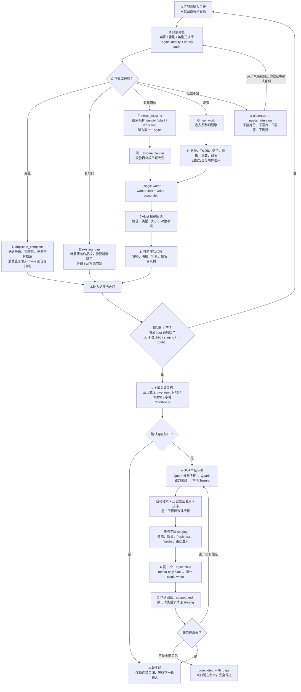

# ScrapeFlow 产品与工程合同

## 0. 权威声明

本文件是 ScrapeFlow 唯一的长期产品与工程合同,于 2026-08-13 取代旧 `AGENTS.md` 与
`ARCHITECTURE.md` 两份文档。层级如下:

- 本文件 = 目标行为 + 工程边界 + Agent 纪律,冲突时的最高权威。
- `README.md` = 操作入口(部署、配置、API、检查命令)。
- `docs/` 下全部文档为历史参考,不覆盖本文件,不授权解除全局暂停或开放自动执行。
- 代码与测试是实现证据;与本文件冲突时以本文件为准,并明确报告冲突。
- 用户最新明确指令与本文件冲突时,报告冲突,不得擅自发明新架构。

## 1. 产品边界

ScrapeFlow 是单用户、单机、Docker Compose 部署的 AList 影视库管理服务:一个 AList、
一个 API 应用、一个正式库 writer、轻量本地 JSON 状态。它不是多用户、分布式、企业级
或公有云平台。

优先级顺序:

1. 正确的媒体行为;
2. 绝不误写/误删正式库;
3. 复用既有成熟代码;
4. 简单控制流 + 人工可恢复;
5. 可维护性;
6. 最后才是抽象与扩展性。

不为假设的未来规模增加复杂度。

用户只提供三样东西:待刮削输入目录、一次性的服务配置(AList/TMDB/PanSou/Helper 凭据)、
`new_work` 首次入库时的一级货架确认。**用户绝不提供分享链接、磁力链接或种子链接**;
补源候选由系统自动搜索、排序并复用历史已验证候选。

## 2. 唯一主流程(A→O 产品合同)

下图是整个 ScrapeFlow 的唯一主流程,不是补源专项流程。所有实现、测试和验收都对齐它。



各节点的硬性合同:

- **A 登记**:只扫描 `/quark/影视/待刮削` 的直接子目录;登记幂等;paused 时允许只读
  登记与对账,不允许任何外部副作用。
- **B/C 五分类判定优先级(显式,处理混合场景)**:
  1. 身份或清单证据链任何一环断裂 → `uncertain`;
  2. 输入含任何可并入既有作品的新媒体 → `merge_existing`(优先于缺口登记);
  3. 既有作品存在已确认缺口、且本次输入不含对应内容 → `existing_gap`;
  4. 输入相对既有作品完全重复 → `duplicate_complete`;
  5. 三库均无匹配且无未知项 → `new_work`。
  目录名只能作为候选线索,不能单独决定归并。
- **D duplicate_complete**:消费 = move 到任务专属归档(`<库根>/ScrapeFlow/归档/<job-id>/processed/`),
  不直接删除;前置条件是身份、完整性、输入所有权三重确认,且无活动 child/Provider/in-doubt;
  归档目录不属于全库审计扫描范围;每步远端回读,歧义即停。
- **E existing_gap**:继承匹配作品的货架与作品根;只有已证明为空的源目录才 hold,
  非空源保留在待刮削并停 `needs_attention`;登记缺口不等于立即联网补源,真正的
  Provider acquisition 必须等 L 之后的 M 门禁。
- **F merge_existing**:继承已确认 identity/shelf/work root;planner 校验目标根不可变;
  不创建第二套入库逻辑。
- **G/H new_work**:只有真正的新作品需要 `movie / anime / us_tv` 一级货架确认,这是
  唯一保留的人工动作;不接受任意目标路径。
- **U uncertain 回流**:系统在对账时把算出的候选身份(片名/年份/TMDB id/置信度)存入
  任务记录并经 API 暴露;用户只做"从候选中确认"或提供 `tmdb_id/media_type/season`
  三元组,之后重新执行同一只读对账。不允许借 uncertain 指定货架、路径、链接或 Provider。
- **I/J/K**:全部正式库写入经唯一 writer(worker lock);每次远端写后 fresh listing +
  精确回读(路径、类型、字节);当前作品验收覆盖 NFO、海报、字幕(外挂/内封/烧录,
  缺目标语言只补一份)、残留与目录树。
- **Q/L barrier**:见第 3 节。L 严格 report-only,复用既有 `SimpleLibraryAuditor`,
  不造第二套扫描器。
- **M/N/O/P**:见第 4 节。staging 在 fresh scoped audit 证明缺口消失前不得清理;
  三阶全部穷尽后进入 `completed_with_gaps` 安全停止,不无限循环。

## 3. L→M 门禁合同

- 放行判定必须收敛为**单一谓词**:admission token(bool)+ admission epoch(int)。
- 授予只有一处:入站结算 barrier 满足(待刮削为空、普通 root 全部收口、无活动
  child/staging/in-doubt、无待决 re-audit)→ L 全库审计成功 → 缺口投影完成且 epoch
  与提交时快照一致。
- 撤销 fail-closed:发现任何新入站对象、或入站目录扫描失败(无法证明"待刮削为空"),
  立即撤销 token 并递增 epoch。
- Provider worker 在启动时与每次外部副作用前复查 token+epoch;被收回时落到持久可见的
  `retry_wait`,状态投影必须在 worker lock 内重读再落盘。
- 重启后的 barrier 放宽**仅限 audit 根的持久 `retry_wait`**;普通正式作品根的任何
  持久活动状态一律阻塞,不得放宽。

## 4. 三阶补源纪律

- 层级顺序固定:`quark_share → quark_magnet → magnet(本地 Torrent)`,不得跳级。
- 失败三分类:`candidate`(资源本身不可用,记入排除账本)、`infrastructure`(网络/
  认证/配额/Helper/AList 故障,停在原阶 `retry_wait`,绝不解释为"没有候选"、绝不降阶)、
  `in_doubt`(外部任务可能已提交,停 `waiting_reconcile`,绝不重复提交)。
- 已知 `external_task_id` 必须先查询对账;没有可靠 task id 的 in-doubt 进入
  `needs_attention`;进程重启不是重新提交的理由。
- 升阶需要穷尽证明:该阶累计足够多的不同失败 locator,或取得"搜索完整且零候选"证明。
- 必需搜索源集合**按货架配置**(`movie / anime / us_tv` 各自的清单);动漫向源清单
  不得成为电影/美剧升阶的隐性阻塞。
- 候选纪律:失败 release/infohash 跨轮排除;正向候选记忆(有界账本)仅是优化,复用
  候选仍须通过全部选择器闸门(覆盖、质量、freshness、可达性);排序硬门槛为缺失季集
  覆盖 → freshness → 2160P → 1080P → 720P,Quark 优先、磁力兜底。
- Provider 输出只能落任务专属 staging:生产固定
  `/quark/影视/ScrapeFlow/补源/<root-job-id>/<attempt-id>`;隔离验收只能以精确的
  `/quark/影视/ScrapeFlow/验收/<run-id>` 为媒体根并由同一根派生 staging。
- Provider 永不直接写正式库、永不决定正式库路径;payload 须通过最小字节准入与
  ffprobe 视频流核验;补源 child 是 media-only,不新建/覆盖每集 NFO 与海报。

## 5. 暂停与重启

- 每次 API 进程启动都默认 paused;此前持久化的 `resumed` 不授权新的外部副作用;
  只有用户在本进程显式 resume 才解除。
- pause 的含义 = 不启动下一个外部副作用;已提交且不可原子取消的操作可以收尾,但在
  下一个 move/upload/delete/Provider submit/child write 边界前必须再次检查。
- 普通任务与 Provider 任务共用同一套暂停语义;不新增控制层、lease、journal 或调度框架。
- 任务重启后先按 AList 当前状态重新核对,再继续或进入可重试失败;`hold`/消费类操作
  的中间态(如 move 已成功但完成标记未写)必须能凭意图记录 + 精确回读安全收口。

## 6. 部署拓扑

Compose 恒为三个服务:`alist`、`api`、`quark-helper`,宿主暴露仅 loopback。API 是
模块化单体;对账、Engine、归档、writer、审计、Provider、状态都是代码模块,不是新容器。

Quark Helper 是窄 sidecar:HTTP 面只有 `health / share-save / magnet-submit /
magnet-status` 四动作,Bearer 认证,cookie 每次从 AList storage 临时解析、只存内存、
不落盘、不出现在日志/health/证据中。Helper 是夸克适配器,不做业务规划,永不决定
正式库路径,也绝不启动/重启/点击夸克;桌面夸克的生命周期由 macOS LaunchAgent 负责
(固定 CDP 参数),CDP 不可用时 Helper fail-closed。

## 7. 必须保留的本地安全

- 源/staging/正式库路径边界与不重叠检查;
- 目标已存在即停,默认不覆盖;
- 归档路径穿越与链接拒绝;有界的成员数/深度/展开体积/压缩比/磁盘保留;
- 伪装可执行文件识别(不执行);
- 最小视频字节准入(默认 1 MiB,硬下限 64 KiB)+ ffprobe 媒体可读性检查;
- 只清理任务所属内容;
- 日志与任务状态中的密码/cookie/token 脱敏;
- 每次正式写入后的 AList 精确回读。

不得为了精简代码而削弱以上任何一条。

## 8. 不得重新引入的复杂度

除非用户明确改变产品范围,不得添加/恢复:应用级全量媒体 SHA-256、plan/content
receipt 与审批 digest、nonce/lease 事务证明、两阶段提交与回滚存储、分布式锁/选主、
本地编排消息队列、多 writer/多实例协调、通用 Provider 插件平台、仅为替换轻量本地
状态的数据库平台、企业审计追踪或 RBAC、常驻生产 E2E/冒烟基础设施。

(协议原生标识不在此列:BT infohash、7z CRC、HMAC 比较、Git 哈希、发布文件哈希照常。
L→M admission epoch 是进程内门禁计数器,不是被禁止的分布式事务证明。)

## 9. 罕见失败:安全停止而不是造框架

```text
常规路径 → 自动化
罕见/歧义路径 → 安全停止 → 告知用户
```

优先使用既有状态(`failed`、`blocked`、`retry_wait`、`needs_attention`);不为低概率
本地故障新建状态机框架。

## 10. Agent 工作纪律

动手前:通读本文件 → 全库搜索既有能力 → 追踪 API → Engine/Provider/writer/state
调用链 → 确认应当获胜的既有权威 → 选择最小改动。

既有权威模块(复用,不得克隆第二套):

- 身份与规划:`engine/scrapeflow/identity_matching.py`、`engine/scraper.py`、
  `engine/scrapeflow/planning/`;
- 全库清单/审计:`local/scrapeflow_api/simple_library_audit.py`;
- 货架枚举:`engine/scrapeflow/target_shelf.py`(封闭三枚举,不是通用启动门);
- 单 writer:`local/scrapeflow_api/simple_engine_runner.py`(全部正式写入必经);
- 归档:`engine/scrapeflow/archive.py` + `archive_preprocessing.py`;
- 补源:`local/scrapeflow_api/automatic_replenishment.py`、`provider_staging.py`、
  `replenishment_tiers.py`;
- Quark:既有 bridge/helper 代码。

改动期间:优先扩展既有代码;diff 收敛;不顺手重写无关模块;不拆分 API 为新服务;
不为实现对账而重写原 Engine。新增任何抽象/类/服务/状态机/持久化格式前,先明确论证
为什么既有实现不能扩展。

运行时安全(除非用户明确要求):不读 `.env.local` 与真实密钥;不动 `.runtime/`、
`.scrapeflow/`、`state/`、`backups/` 与真实媒体;不启动 Docker Compose;不连真实
AList/TMDB/Quark/PanSou/aria2;不执行破坏性 Git 命令。默认使用源码检查、
fake/in-memory 客户端与聚焦测试。

## 11. 测试与验收

使用既有 Python `unittest`。测试是护栏,不是产品权威;当测试固化过时行为时,随产品
合同一起更新。

门禁类测试必须从不变量出发穷举,而不是照实现补断言。优先覆盖:五分类结果、身份复用
不建重复作品、仅新作品确认货架、路径/不覆盖边界、单 writer、外部副作用边界的暂停、
Provider 层级顺序与三分类、已知 external task 查询而非重提、归档安全回归、
barrier/admission 的持久状态 × 扫描结果穷举矩阵。

统一本地检查命令:

```sh
python3 scripts/scrapeflow_release_check.py
```

本地测试、`docker compose config` 与镜像构建通过 ≠ 真实验收。宣布 release 前必须
在隔离环境逐项留证:五分类各一真实样本、三条补源线路(夸克分享/夸克磁力/本地
Torrent)、pause/restart 中断恢复、备份/恢复演练。端到端测试不得加载生产
`.env.local`、真实凭据或把生产目录当夹具。
