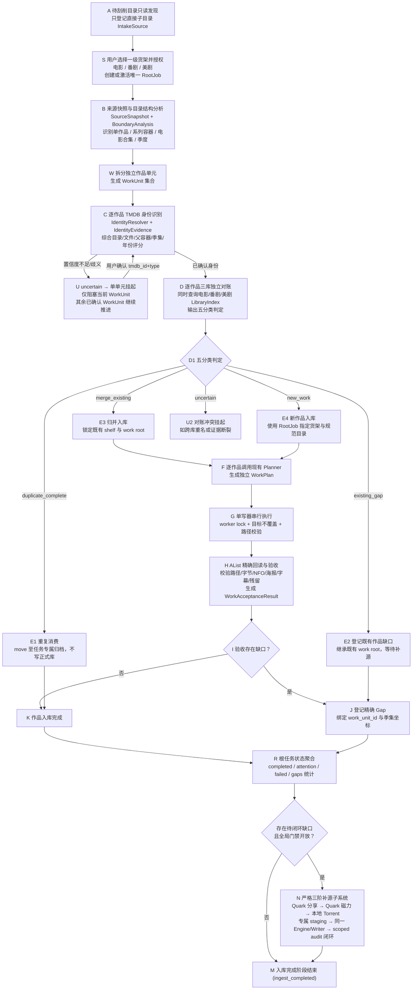

# ScrapeFlow 产品与工程合同

## 0. 权威声明

本文件是 ScrapeFlow 唯一的长期产品与工程合同。层级如下:

- 本文件 = 目标行为 + 工程边界 + 领域模型 + Agent 纪律,冲突时的最高权威。
- `README.md` = 操作入口(部署、配置、API、检查命令)。
- `docs/` 下全部文档为历史参考,不覆盖本文件,不授权解除全局暂停或开放自动执行。
- 代码与测试是实现证据;与本文件冲突时以本文件为准,并明确报告冲突。
- 用户最新明确指令与本文件冲突时,报告冲突,不得擅自发明新架构。

### 实现状态说明 (Phase 0 冻结基线，2026-08-16)

目标领域模型（`IntakeSource → RootJob → WorkUnit`）已实现并接入入站链路（见下方迁移状态）。
既有 legacy execution core 保留为**内部单作品执行与回读载体**（`EngineJob`），继续冻结。禁止在过渡期内执行以下操作：

- **禁止**继续往 `EngineJob.summary` 新增业务语义字段；
- **禁止**新增 release evidence 包装、provider gate 层级、admission barrier 规则；
- **禁止**创建第二套 writer 或第二套 TMDB 匹配器；
- **必须**通过 `IntakeSource → RootJob → WorkUnit` 路径新增功能，而不是扩展 `EngineJob` phase 字段。

测试基线（2026-08-16 实测）：**850 tests passed, 310 subtests passed, 0 failed**（`python3 -m pytest local/tests/ -q`，35 秒）。
任何代码变更不得使通过数减少。

迁移状态：目标架构迁移 **P0–P10 已完成**（2026-08-16）：

- A/S：待刮削只读发现（零 job 创建）、Web 创建任务（来源+货架，`POST /api/root-jobs`）；
- B/W/C/U：快照与边界分析（`root_boundaries`）、逐单元身份与 durable override（`unit_identity`，确认端点 `/api/jobs/:id/work-units/:unit/confirm`）；
- D：三库 `LibraryIndex` 五分类对账（跨货架查重，`library_index`）；
- F/G/H：单元驱动规划 + 唯一写器 + `WorkAcceptanceResult`（`unit_execution`，EngineJob 为内部载体）；
- J/N：Gap 账本绑 `work_unit_id`（`gap_ledger`）；字幕独立渠道默认关闭且缺陷已修；
- R：根任务聚合（`root_aggregation`，`GET /api/jobs/:id/work-units`）；
- 合规：作品名硬编码全部数据化（`engine/scrapeflow/data/release_lexicon.py`）、货架-媒体类型矩阵已删除、TMDB 匹配器统一为单一评分核心；
- 测试：`tests/corpus/` 10 场景 + 真实 A→B→W→C→D 链路回归。
- 存量 `EngineJob.summary` 业务字段与 provider gate 机制保持冻结，随后续运行节奏继续清退。

## 1. 产品边界与核心领域模型

ScrapeFlow 是单用户、单机、Docker Compose 部署的 AList 影视库管理服务:一个 AList、一个 API 应用、一个正式库 writer、轻量本地 JSON 状态。它不是多用户、分布式、企业级或公有云平台。

### 核心领域主语层次

系统必须遵循以下第一等领域主语,禁止将所有职责压缩入单一扁平对象:

```text
IntakeSource (只读发现)
  └── RootJob (用户授权的唯一根任务)
        └── WorkUnit (独立作品单元)
              ├── ConfirmedIdentity (TMDB 身份)
              ├── ReconciliationDecision (三库五分类对账结果)
              ├── SourceObjectRef[] (来源文件所有权清单)
              ├── WorkPlan / WriterRun (作品级执行计划)
              └── Gap[] (缺口账本)
                    └── AcquisitionAttempt[] (补源尝试)
```

- **`IntakeSource`**: `/待刮削` 下直接子目录的只读发现记录。发现本身**不是执行任务**，不拥有执行 phase。
- **`RootJob`**: 用户授权选择一级货架后创建/激活的唯一根任务。同一来源路径永远映射到唯一 `RootJob`。
- **`WorkUnit`**: 根任务通过目录结构分析拆分出的独立作品。一个 Fate 容器根任务可包含多个 `WorkUnit`。
- **`MediaItem` / `SourceObjectRef`**: 具体媒体文件及其归属关系，禁止跨任务/跨单元重叠所有权。
- **`Gap`**: 属于特定作品和具体季集坐标的缺口。
- **`AcquisitionAttempt`**: 针对缺口的单次补源尝试。
- **既有 `EngineJob`**: 属于 legacy execution core，退化为内部单作品执行与回读载体，不再充当顶层业务实体。

优先级顺序:
1. 正确的媒体行为;
2. 绝不误写/误删正式库;
3. 目录结构理解与作品边界发现发生在身份对账之前;
4. 每个作品独立识别与对账，单个子项 uncertain 不阻塞兄弟作品;
5. 复用既有成熟单写器、回读、审计与补源 staging 安全代码;
6. 简单控制流 + 人工可恢复;
7. 最后才是抽象与扩展性。

## 2. 唯一主流程 (A→P 产品合同)

下图是 ScrapeFlow 的主流程架构。所有实现、测试和验收均需对齐此链路:



### 各环节核心规则

1. **A/S 只读发现与根任务授权**:
   - 扫描 `/quark/影视/待刮削` 的直接子目录，更新 `IntakeSource`；
   - 未点击创建任务前，**零整理、零对账、零 TMDB 请求、零状态机 job**；
   - 用户选择来源并指定一级货架（`movie / anime / us_tv`）后创建或恢复唯一 `RootJob`。
2. **B/W 目录结构与作品边界分析 (BoundaryAnalysis)**:
   - 必须在 TMDB 匹配之前执行；
   - 提取目录层级、直接文件与子目录比例、视频/字幕分布、季度标记、集数序列、年份、剧场版/OVA/SP、版本压制组特征；
   - 目录角色枚举包括：`single_work`, `series_container`, `season`, `movie_collection`, `special_group`, `version_group`, `release_group`, `subtitle_group`, `extras_group`, `resource_group`, `uncertain`；
   - 严禁将 Fate、高达等系列容器顶层直接认作单部 TV。
3. **C/U 作品级身份识别与证据评分**:
   - 匹配器接收结构化 `IdentityEvidence`（边界名、代表文件名、父容器弱证据、年份、媒体形态）；
   - 电影与剧集候选并行评分，记录打分明细与 margin；
   - 歧义项置为 `uncertain`，仅挂起当前 `WorkUnit`，**不阻塞兄弟作品单元推进**；
   - 人工确认持久化为 durable override，仅确认 `media_type + tmdb_id`（及必要季号），不暴露内部 JSON 或任意目标路径。
4. **D 逐作品三库独立对账 (LibraryIndex)**:
   - 同时在电影、番剧、美剧三个正式库中建立的 `LibraryIndex` 中查重；
   - 判定优先级：`uncertain`（冲突/断裂） $\rightarrow$ `merge_existing`（有可归并新媒体） $\rightarrow$ `existing_gap`（既有作品缺口） $\rightarrow$ `duplicate_complete`（完全重复） $\rightarrow$ `new_work`（全新作品）；
   - `merge_existing` 必须严格锁定既有作品的 shelf 与 `work_root`，禁止覆盖。
5. **G/H 统一单写器与精确回读验收**:
   - 所有正式库写入必须经过唯一写器（单写锁、不覆盖、路径防穿越）；
   - 写入后执行 fresh listing + 精确回读（路径、类型、字节数、NFO、海报、字幕证据）；
   - 生成结构化 `WorkAcceptanceResult`。
6. **J/N 补源作为缺口闭环子系统**:
   - Gap 精确绑定到 `work_unit_id` 与坐标；
   - 补源获取的媒体进入任务专属 staging，生成临时 inventory 重新经过统一 Engine 与 writer；
   - 经定向审计证明缺口真实消失后才核销对应 Gap 并清理 staging。

## 3. 必须保留的本地安全底线

- **源/staging/正式库路径绝对隔离与不重叠检查**；
- **目标已存在即停，默认绝不覆盖**；
- **归档路径防穿越与软硬链接拒绝**；
- **最小视频字节准入 (默认 1 MiB, 硬下限 64 KiB) + ffprobe 媒体流有效性检查**；
- **写后精确回读 (fresh listing + 字节/类型严格核对)**；
- **只清理当前任务所属范围，不触碰公共容器或正式库**；
- **任务所有权隔离 (两个任务绝不重叠 claim 同一来源对象)**；
- **敏感信息脱敏 (密码、token、cookie 绝不落盘与入日志)**。

## 4. 补源三阶纪律与 Staging 隔离

- 层级顺序固定：`quark_share → quark_magnet → magnet(本地 Torrent)`，不得跳级；
- 失败三分类：`candidate`（资源问题，排除）、`infrastructure`（网络/认证/AList 故障，原阶 `retry_wait`，绝不降阶）、`in_doubt`（可能已提交，`waiting_reconcile`，绝不重复提交）；
- Provider 永不直接写正式库，永不决定正式库路径；
- 补源产物落入任务专属 staging，通过同一 Engine 和单写器正式入库。
- 字幕缺口走独立字幕渠道（字幕站点直搜；混合候选中只提取字幕成员，不下载整集视频），
  不占用视频三阶带宽；该渠道同样遵守 staging 隔离、失败三分类（candidate/infrastructure/in_doubt）
  与同一 writer 闭环（2026-08-16 用户裁决）。

## 5. 暂停与可恢复性

- API 进程启动默认 paused，需用户显式 resume；
- 暂停边界为下一个外部副作用（move/upload/delete/submit/write）之前；
- 任务重启后凭持久化意图记录与远端 fresh 状态安全恢复，不重复执行已完成写入。

## 6. 不得引入的过度复杂度

- 不引入多服务/微服务架构；
- 不引入消息队列（RabbitMQ / Kafka / Redis）；
- 不引入外部数据库平台（MySQL / PostgreSQL / MongoDB），保持轻量原子本地 JSON；
- 不做应用级全量大文件 SHA-256 哈希（使用路径、类型、大小、版本四元组）；
- 不做第二套 writer 或第二套 TMDB 匹配器。

## 7. 测试与回归纪律

- 单元测试与真实案例回归是系统安全护栏；
- 建立 `tests/corpus/` 真实用例库，覆盖普通电影、多季美剧、绝对集数动画、OVA、电影合集、系列容器（Fate、高达、物语）等场景；
- 真实案例测试必须走完整真实链路，严禁在 fixture 中硬编码绕过 Engine；
- 严禁在业务代码中写入特定作品名称硬编码（如 `if "Fate" in name`）。

## 8. 端口与部署配置

- **容器内部端口**：API 服务监听 `8765`（固定，不可更改）；
- **宿主暴露端口**：默认 `3010`，由环境变量 `SCRAPEFLOW_API_PORT` 控制；
- **Compose 映射**：`127.0.0.1:${SCRAPEFLOW_API_PORT:-3010}:8765`；
- **测试 fake payload**：compose_evidence 测试中的 fake runner 须反映真实映射
  （`published: "3010"`, `target: 8765`），而非旧的 `published: "8765"` 形式；
- **Quark Helper**：宿主侧 `18765`（仅内部通信，不对外暴露）。
